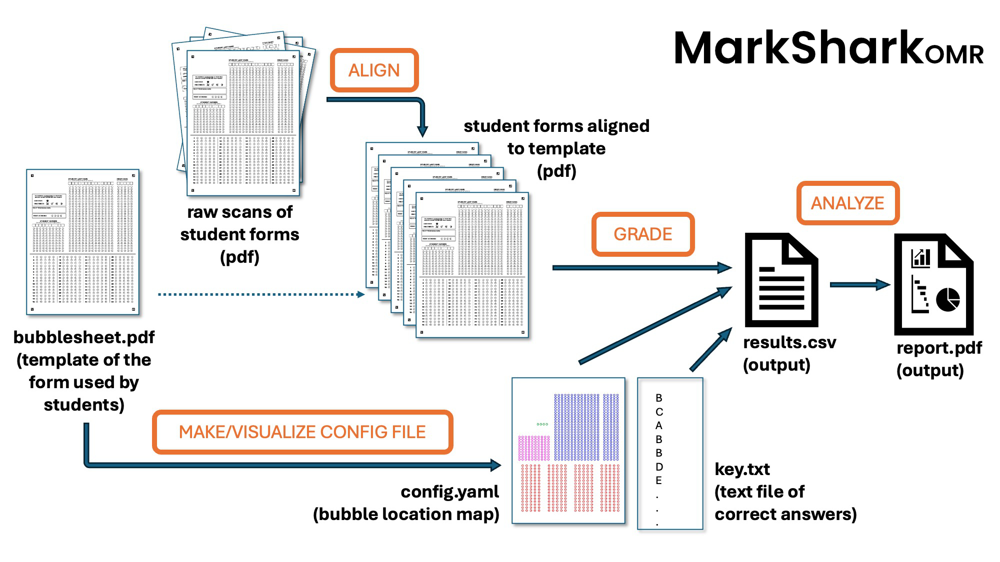

# MarkSharkOMR
## A fast, accurate, customizable, open-source test bubble sheet scanner

MarkSharkOMR is a versatile and fast tool to **visualize, grade, and analyze bubble-sheet exams**. 

It supports command-line and GUI modes, and outputs annotated images, CSV results, and detailed item-analysis statistics.

[](https://www.gnu.org/licenses/agpl-3.0)
---

---

## 🧰 Prerequisites

- **Python 3.9 – 3.12**
---

## 📦 Installation

Clone and install the package locally:

```bash
git clone https://github.com/navarrew/markshark.git
cd markshark
pip install -e .
```

Make sure you install required dependencies (OpenCV, Typer, Streamlit).


---
# MarkShark overview
---
# Step 1 - How to Make a Bubble Sheet for MarkShark

## 1. Create your bubble sheet (the exam form)
Start by making a bubble sheet and saving it as a **PDF file**.
- You can use one of the ready-made templates in the **“bubble forms”** folder.
- If you want to design your own, you can use any drawing or layout program that can export to PDF.
  - We made ours with **Affinity Designer** (similar to Adobe Illustrator).
  - **Inkscape** is a good free option that works with `.svg` files and can export to PDF as well.
  - Feel free to modify any templates we provide to meet your own needs.

## 2. Add alignment markers (ARUCO markers) - optional
We recommended that you include **ARUCO markers**—small black-and-white squares in the corners of your page.
- These serve as landmarks that help the software detect and correct any **rotation, skew, or scaling** that happens when the bubble sheets are scanned.
- We provide these markers in our template files as png images.  You can paste one in each corner of your bubble sheet template.
- You can generate ARUCO markers with many free online tools or within MarkShark’s utilities
- Without these markers, scans that are even slightly off may not align correctly during analysis.

## 3. Make a configuration file (`config.yaml`)
The configuration file tells MarkShark where everything is located on your bubble sheet—
for example,
- where the **question bubbles** are,
- where the **student ID section** is, and
- any other important zones (like name boxes, version codes, etc).

The config file is like a map that tells bubble_score.py where the bubbles are located on the bubble sheet and what type of bubble the are (student name, student ID, test version, or the answer to a question).  This is a very important starting step because if the config file doesn't line up well with the bubble sheet then you will get poor results.  The software will look for bubbles where there aren't any.

To test and adjust this setup:
- Use MarkShark’s **visualizer** function to see how the zones from your `config.yaml` file align with your PDF template.
- If they don’t line up perfectly, adjust the coordinates in the config file and recheck until everything matches cleanly.

## 4. Make an answer key
Create a plain text file (for example, `key.txt`) that lists the correct answers.
- Answers can be separated by **commas** (e.g. `A,B,A,D,C,C,D`)
  or placed on **separate lines**, one per question.
- Make sure the number of answers matches the number of questions on your sheet.

# Step 2- Scan and align your bubble sheets

You can scan your student bubble sheets using any typical desktop scanner (flatbed or fed through a feeder).  After scanning, even with a quality scanner, it is typical that the page images will be randomly a bit off-center or askew.  A small bit of rotation in a page is usually tolerated by the scoring software but much better results will be obtained the pages are pre-processed to align almost perfectly with the map in config file.

## 1.	Scan your student bubble sheets with a high quality scanner.
You can, in theory, scan by taking pictures with your phone but we don't recommend it because the lighting across the page will vary and you will have to adjust the skew, etc.  You'll spend more time correcting and adjusting your scans than it's worth.

## 2. It's easiest if the scans are saved as a single multi-page pdf at 150 or 300 dpi (grayscale or color).
## 3.	Align the student pdfs to a blank version of the bubble sheet (the clean, original pdf file is best) using the **align** functions of MarkShark.  You will get a new pdf where all the bubble-sheets within are aligned to your template so the software can accurately find the bubbles.

## Step 3- Score 
1.	Run the **grade** function on the aligned pdf file in a directory that also has the key.txt file and the config file.  
2.  You will get an output comma-separated file with each student in a row, their answers, and their final score
3.  You can optionally export a pdf of the bubble sheets with circles that visually indicate which bubbles were scored.  This is useful for diagnosing issues if you have any.

## Step 4 - Analyze the results and assess how good your questions are
1.	Run the **stats** function on the csv file that was the output of the grade program.  This will give you an overall picture of student performance.


---
# Detailed instructions

## Making your bubble sheet
If you're in a hurry, we provide a few different templates (and their corresponding config files) that should be ready to use right away with no issues.  You can also freely modify these files for your own use.  If you want to make your own bubble sheet from scratch that's fine too.

Suggestions:
1. You should align the bubbles with even spacing between each.  You'll run into problems if the gaps between bubbles are not consistent.   Use the 'align' and 'distribute' features on your graphics software to ensure your bubbles are aligned properly.

2. You may want to decrease the darkness of the bubbles themselves (gray instead of black circles and letters) so the student marks stand out more against the background of the bubbles. (I made my bubbles with hollow black circles and dialed their transparency down to 50% before saving as a pdf.)

---
## Using the visualizer to make the config file for your bubble sheet template


Config files are written in 'YAML' format.


---
## Aligning your scanned documents with 'align'.


A philosophy of 'garbage in, garbage out' should apply here.  The higher quality scans you provide, the less likely you'll have issues later.  300 dpi inputs are great.  A high quality scanner that isn't prone to warping or scrunching is also great.


---
## Scoring the tests with grade


---
## Analyzing the results with stats

The *stats* processes the output from *grade*. It supports a KEY row (with correct answers) and student responses, converts them into a correctness matrix (0/1), and computes per-item and exam-level statistics.

### Usage
Basic command:


### Outputs
1. Main CSV (results_with_item_stats.csv):
- Original data (including KEY row).
- Appends two rows at the bottom:
  * 'Pct correct (0-1)' or '(0-100)': item difficulty.
  * 'Point–biserial': discrimination index of each item.
2. Exam-level stats (exam_stats.csv):
Contains summary statistics:
- k_items: Number of questions.
- mean_total, sd_total, var_total: Distribution of student scores.
- avg_difficulty: Mean proportion correct across items.
- KR-20: Reliability estimate for dichotomous items.
- KR-21: Approximate reliability using mean difficulty.
3. Item report (item_analysis.csv):
One row per item-option combination:
- item, key, option, is_key.
- option_count, option_prop: How often each option was selected.
- option_biserial: Correlation between choosing this option and total score (excl. item).
- item_difficulty, item_point_biserial.
4. Item plots (item_plots/):
One PNG per item, showing a nonparametric Item Characteristic Curve (ICC):
- X-axis: binned total-minus-item score.
- Y-axis: proportion correct in each bin.

Interpretation of Statistics
•	Difficulty (Pct correct): Proportion of students who answered correctly. Ideal values often 0.3–0.8.
•	Point–biserial: Correlation between correctness and total score (excluding the item). Higher positive values indicate better discrimination. Negative values are problematic.
•	KR-20: Reliability coefficient for dichotomous items. Higher values (≥0.7) indicate consistent test performance.
•	KR-21: Approximation of KR-20 assuming items have similar difficulty. Useful when item-level data is limited.
•	Option biserial: Correlation between selecting a particular option and student ability. Correct option should be positive; distractors should be negative or near-zero.


---

## Example Config (YAML)

```yaml
# 64_question_config_axis.yaml
# coordinates are given in percentages from top (y values) and left (x values) of page.
# x_topleft: 0.5 -> means a point 50% or in the middle of the page from left to right

# -----------------------------
# Name blocks (select one row per column)
# -----------------------------
last_name_layout:
  x_topleft: 0.3737
  y_topleft: 0.1148
  x_bottomright: 0.7537
  y_bottomright: 0.5603
  radius_pct: 0.008
  questions: 27            # synonymous with rows (letters incl. leading space)
  choices: 14              # synonymous with columns (positions)
  bubble_shape: circle
  selection_axis: col
  labels: " ABCDEFGHIJKLMNOPQRSTUVWXYZ"

first_name_layout:
  x_topleft: 0.8106
  y_topleft: 0.1148
  x_bottomright: 0.9278
  y_bottomright: 0.5603
  radius_pct: 0.008
  questions: 27
  choices: 5
  bubble_shape: circle
  selection_axis: col
  labels: " ABCDEFGHIJKLMNOPQRSTUVWXYZ"

# -----------------------------
# Student ID (select one row per column)
# -----------------------------
id_layout:
  x_topleft: 0.0510
  y_topleft: 0.4058
  x_bottomright: 0.3110
  y_bottomright: 0.5603
  radius_pct: 0.008
  questions: 10           # rows 10
  choices: 10             # 10 digit positions
  bubble_shape: circle
  selection_axis: col
  labels: "0123456789"

# -----------------------------
# Test version (select one column in a single row)
# -----------------------------
version_layout:
  x_topleft: 0.2173
  y_topleft: 0.3179
  x_bottomright: 0.2965
  y_bottomright: 0.3179
  radius_pct: 0.008
  questions: 1
  choices: 4
  bubble_shape: circle
  selection_axis: row
  labels: "ABCD"

# -----------------------------
# Answer blocks (select one column per row)
# -----------------------------
answer_layouts:
  - x_topleft: 0.0801
    y_topleft: 0.6035
    x_bottomright: 0.2275
    y_bottomright: 0.9130
    radius_pct: 0.007
    questions: 16
    choices: 5
    bubble_shape: circle
    selection_axis: row
    labels: "ABCDE"
    
  - x_topleft: 0.3157
    y_topleft: 0.6035
    x_bottomright: 0.4631
    y_bottomright: 0.9130
    radius_pct: 0.007
    questions: 16
    choices: 5
    bubble_shape: circle
    selection_axis: row
    labels: "ABCDE"

  - x_topleft: 0.5514
    y_topleft: 0.6035
    x_bottomright: 0.6988
    y_bottomright: 0.9130
    radius_pct: 0.007
    questions: 16
    choices: 5
    bubble_shape: circle
    selection_axis: row
    labels: "ABCDE"

  - x_topleft: 0.7875
    y_topleft: 0.6035
    x_bottomright: 0.9341
    y_bottomright: 0.9130
    radius_pct: 0.007
    questions: 16
    choices: 5
    bubble_shape: circle
    selection_axis: row
    labels: "ABCDE"

total_questions: 64
```

---

## Outputs

- **Aligned scans**: multipage PDF (`aligned_scans.pdf`)
- **Overlay visualization**: PNG preview of config zones
- **Grading results**: `results.csv` per student
- **Annotated sheets**: optional PNGs in `annotated/`
- **Stats**: item analysis, KR-20 reliability, difficulty, point-biserial

---


## License

MarkShark — the open-source bubble hunter  
Copyright (c) 2025 William Navarre, University of Toronto  
Licensed under the **GNU Affero General Public License v3 (AGPL-3.0)**.

You are free to use, modify, and redistribute this software for **academic, research, and open-source** purposes, provided that derivative works remain open-source and disclose their source code under the same license.

**Commercial or institutional deployment** (e.g. SaaS, proprietary educational tools, or for-profit distribution) requires a separate license.

For licensing inquiries, contact [william.navarre@utoronto.ca](mailto:william.navarre@utoronto.ca).
