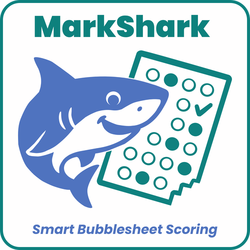
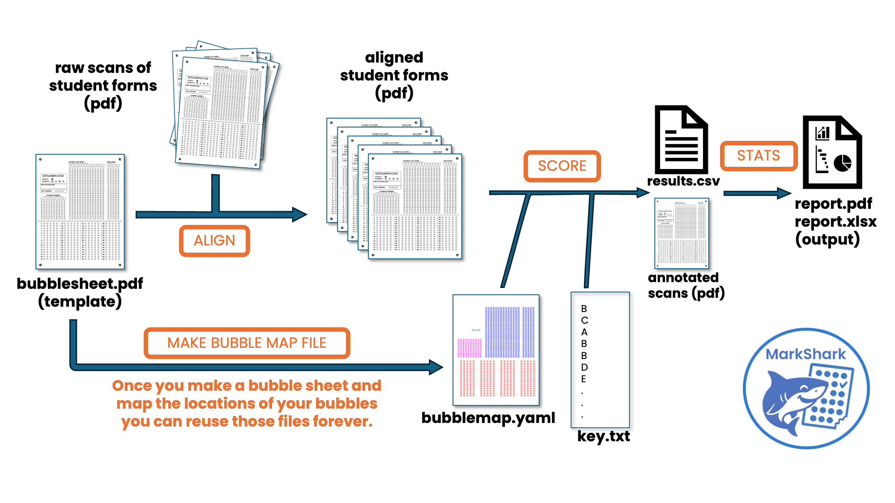

# MarkSharkOMR - in development
## A fast, accurate, customizable, open-source test bubble sheet scanner

MarkSharkOMR is a versatile and fast tool to **grade, and analyze your own bubble-sheet exams**.


[](https://www.gnu.org/licenses/agpl-3.0)

---



---

## Prerequisites

- **Python 3.9–3.12**

---

## Installation

Clone and install the package locally:

```bash
git clone https://github.com/navarrew/markshark.git
cd markshark
pip install -e .
```

Make sure you install required dependencies (**OpenCV**, **Typer**, **Streamlit**).

---

# Using MarkShark

MarkShark is in development.  It currently works well after being tested in a real-world scenario of a class of 270 students with two midterms and a final (a total of over 700 scans).  

We provide a manual as a pdf in the main github directory.  Help is also available from the command line.  For the time being documentation is being kept current in the pdf manual and not on this markdown page. 

We also provide template bubblesheets and necessary mapping files for each that you can customize for your own use. 

To use the graphical interface instead of the command line - from the command line type:
```bash
markshark-gui
```

Currently MarkShark only works on 1 page scans (not bubblesheets that have a front and back side).  Currently it only accepts one version key at a time (must grade version A of your test, then separately version B).  Both of these limitations will be addressed in the near future.

---

## License

**MarkShark — the open-source bubble hunter**  
Copyright © 2026 William Navarre, University of Toronto  
Licensed under the **GNU Affero General Public License v3 (AGPL-3.0)**.

You may use, modify, and redistribute this software for **academic, research, and open-source** purposes, provided derivative works remain open-source under the same license.

**Commercial or institutional use** (e.g., SaaS platforms, proprietary educational tools, or for-profit distribution) requires a separate license.

For licensing inquiries, contact [william.navarre@utoronto.ca](mailto:william.navarre@utoronto.ca).
