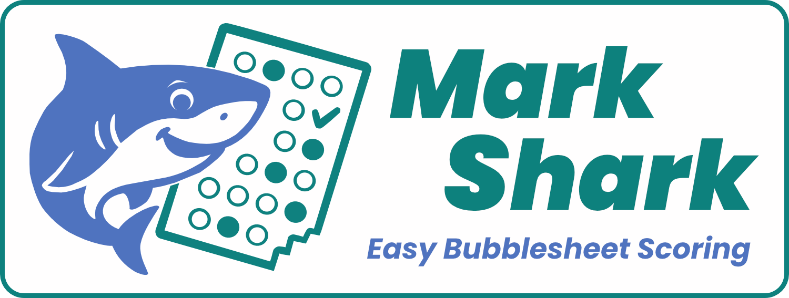

# MarkShark
## An easy, fast, accurate, customizable, test bubble sheet scorer



MarkSharkOMR is a versatile and fast tool to **grade, and analyze your own bubble-sheet exams**.

[](https://www.gnu.org/licenses/agpl-3.0)
[](https://pypi.org/project/markshark/)

---
MarkShark exists because grading paper exams should not require permission, fees, or delays.

I built MarkShark so I could scan and score exams in my own office, release results the same day, and use bubble sheets that actually fit my tests. I wanted to work on the computer I already use, without buying software or relying on a central scanning service.

For many instructors, automated grading still means giving up control. Exams must fit a single Scantron form. Requests are submitted in advance. Tests are processed on someone else’s schedule. Small changes or rescoring take days. Students wait, email, and worry.

MarkShark is designed so instructors can grade their own assessments, on their own timeline, using forms they designed themselves or selected from ready-made templates. It works with ordinary scanners or photocopiers, runs on Mac, Windows, and Linux, and produces results you can inspect and reuse anywhere.

If you can print an exam and scan it, you should be able to grade it quickly and move on.

***It's completely free.  Really.***  
- No paywalls or microtransactions.
- No licensing requirements.
- No arguing with your school about the costs of scanning.
- You print your own bubble sheets, you don't have to order them.
- You can use a scanner you probably already have access to.

**MarkShark makes it easy for you.**
- MarkShark works on both Mac and PC computers.
- You control the data and can go from scans to scores in minutes.
- We provide dozens of bubblesheet templates for you to choose from.
  - *You can your own custom bubble sheets using our companion platform 'Bubblefish'*
- Make a mistake with your answer key?  No problem!  You can rescore in seconds!
- A student fill in their ID incorrectly?  No problem!  You can fix it with a click!
- You scanned one page upside-down?  No problem!  Our PDF tools can fix it fast!
- You want to copy student scores directly into the spreadsheet your course software uses?  No problem!  It's easy to integrate MarkShark with any LMS!
- MarkShark works for courses as small as 10 students to classes bigger than 1000!
- MarkShark accepts a variety of answer key formats.
- MarkShark generates a report that is easy to read and understand.
- MarkShark produces annotated student scans make it easy to see and understand why a student got their score.

---

## Prerequisites

- **Python 3.10–3.13**

---

## Installation
MarkShark is currently available via 'pip' (Python package installer) and as pre-built standalone applications for Mac and PC.

```bash
pip install markshark
```

### Launch the desktop GUI
```bash
markshark-gui
```

### Or use the command-line interface
```bash
markshark --help
```

## Dependencies (installed automatically with pip)
- PySide6>=6.6
- typer>=0.12
- rich>=13.7
- opencv-contrib-python>=4.9
- numpy>=1.26
- pymupdf>=1.24
- pdf2image>=1.17
- pandas>=2.1
- matplotlib>=3.8
- pyyaml
- openpyxl>=3.0
- rapidfuzz>=3.0


---

# About MarkShark

MarkShark is in active development.  It currently works well after being tested in a real-world scenario of a class of 270 students with two midterms and a final (a total of over 700 scans).  You can go from 500 scanned student bubblesheets to a final report in less than five minutes.

MarkShark includes a full **desktop GUI** (built with PySide6) and a **command-line interface** for scripting and automation.  All settings are stored in `~/.markshark/` for easy backup and clean uninstall. 

MarkShark works with a variety of bubblesheet formats (you can easily generate your own custom bubblesheets) and it rapidly generates reports about student performance and the quality of the test questions.  We provide template bubblesheets and necessary mapping files for each that you can customize for your own use. 

It accepts multiple versions of the same test (you provide a single key file that has the correct answsers for all versions).  

If you provide MarkShark with your class roster it can tell you who was missing from the test (absent) and flag 'orphan' scans (where the student didn't fill in their information properly.  MarkShark also flags issues like unfilled bubbles (unanswered question), rows where more than one bubble was filled in, for you to review and correct if necessary.  It provides student scores in a spreadsheet format that is easily pasted into spreadsheets and into LMSs like Blackboard and Canvas.

For testing prior to use MarkShark can generate fake student data including fake filled in bubblesheets that you can print out, rescan, and test for yourself before committing yourself to using MarkShark.

# What you provide
If you want to use a bubblesheet you've been using in the past you will need to generate a map (bubblemap.yaml) file that tells MarkShark where the bubbles are and what the bubbles represent.  You need to provide MarkShark with a pdf of the blank bubblesheet (the master template) and its corresponding bubblemap one time.  You can save these templates into MarkShark and reuse them again and again with a single click.

Then for each test you simply upload your scanned student sheets as a pdf. If you have folder of jpg or png images we have a utitlity that quickly connverts them to a pdf.  A key is optional but required for getting student scores (percent correct, etc).  If you also provide the class roster, MarkShark identify students who were absent and give you back scores in a format you can easily upload back to your learning management software (LMS like Blackboard, Canvas, Moodle, Sakai, Open edX).

## License

**MarkShark — the open-source bubble hunter**  
Copyright © 2026 William Navarre, University of Toronto  
Licensed under the **GNU Affero General Public License v3 (AGPL-3.0)**.

You may use, modify, and redistribute this software for **academic, research, and open-source** purposes, provided derivative works remain open-source under the same license.

**Commercial or institutional use** (e.g., SaaS platforms, proprietary educational tools, or for-profit distribution) requires a separate license.

For licensing inquiries, contact [william.navarre@utoronto.ca](mailto:william.navarre@utoronto.ca).
