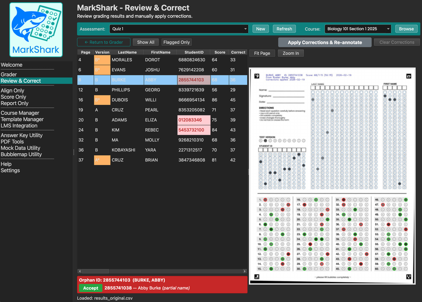
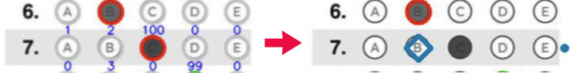

# Review & Correct

The Review & Correct page is where you check over your scored bubble sheets and fix any issues before generating your final report. After scoring, it is wise to review the results — students often mis-fill their names, forget to bubble their student ID, skip a row, or erase a bubble poorly enough that the scanner picks it up as a mark.

**Important: corrections vs. rescoring.** This page is for fixing *individual student issues* — a student who skipped a row, filled two bubbles, or entered the wrong ID number. If you discover that your *answer key itself* has a mistake (a wrong answer, a missing version, etc.) you should **not** fix it here student by student. Instead, go back to the Grader page, fix or replace your answer key, and use the **Rescore** option to re-mark everybody at once. Rescoring is faster, more accurate, and ensures every student is graded against the same corrected key.

## Table of Contents
- [The Review & Correct Layout](#the-review--correct-layout)
- [What Gets Flagged](#what-gets-flagged)
- [Making Corrections](#making-corrections)
- [Applying Corrections](#applying-corrections)
- [Tips for an Efficient Review](#tips-for-an-efficient-review)
- [How Corrections Are Stored](#how-corrections-are-stored)

---

## The Review & Correct Layout

The page is split into two panels:

- **Left panel — the spreadsheet.** Shows one row per student with their detected answers, scores, names, and IDs. Flagged cells are highlighted in colour so problems stand out immediately.
- **Right panel — the PDF preview.** Shows the annotated scan for whichever student you have selected. You can zoom in to see exactly what the student bubbled.

Below the spreadsheet is a **flag info panel** that explains what is wrong with the currently selected student (e.g. "blank at Q5, multi-mark at Q10, orphan ID").

### Filtering

At the top of the spreadsheet you'll see two toggle buttons:

- **Flagged Only** (default) — Shows only students who have at least one issue that needs review. This is usually where you want to start.
- **Show All** — Shows every student. Useful when you want to browse or spot-check.

---

## What Gets Flagged

MarkShark flags rows that need human attention. Flagged cells are colour-coded in the spreadsheet:

| Colour | Flag | What It Means |
|--------|------|---------------|
| Pink | **Blank** | No bubble met the fill threshold for this question. The student may have skipped it, or filled it too lightly. |
| Orange | **Multi** | Two or more bubbles appear filled in the same row. The student may have changed their answer without erasing fully. |
| Light red | **Orphan ID** | The student's bubbled ID does not match any entry on your class roster. They may have mis-filled a digit. |

When you click on a flagged student, the PDF preview on the right shows their scan so you can see exactly what happened. The flag info panel at the bottom explains the flags for that student.

---

## Making Corrections

### Correcting an answer

If you can see from the scan that the student clearly intended a particular answer (e.g. they erased bubble B poorly but clearly filled bubble C), you can fix it:

1. Find the question column in the spreadsheet (Q1, Q2, Q3, etc.).
2. **Double-click** the cell to edit it.
3. Type the correct answer letter (e.g. `C`). For a multi-answer question, type the letters together (e.g. `AC` or `A,C`).
4. Press **Enter**. The cell turns blue to show that a correction has been applied.

After correction and re-annotation, manually corrected answers are distinguished in the scored_scans.pdf with a blue diamond and a blue dot next to the row to make them easy to spot.

### Correcting a student ID

If a student mis-bubbled their ID (common with orphan ID flags):

1. Find the **StudentID** column for that student.
2. **Double-click** and type the correct ID number.
3. Press **Enter**.

If you provided a class roster, MarkShark will try to help. When you select a student with an orphan ID, the flag info panel shows **suggested matches** from your roster — students whose IDs are similar to what was bubbled or who haven't been matched yet. Click a suggestion to accept it, and MarkShark fills in the corrected ID for you.

### Correcting a name

If a student's last name or first name was mis-read, double-click the **LastName** or **FirstName** cell and type the correct name.

### Reverting a correction

Changed your mind? **Right-click** on any corrected cell (shown in blue) and choose **Revert to Original**. The cell returns to whatever MarkShark originally detected.

---

## Applying Corrections

Making corrections in the spreadsheet does **not** immediately change your scored PDF or CSV file. Corrections are saved to a separate log so your original scoring data is always preserved.

When you are satisfied with your corrections, click the **Apply Corrections & Re-annotate** button. This will:

1. Re-run scoring with all your corrections applied.
2. Update the **scored_scans.pdf** — corrected answers are marked with teal diamonds and a "Corrections applied" stamp so you can tell them apart from the original scoring marks.
3. Update the **results.csv** with the corrected scores.
4. Save a backup of your original results as **results_original.csv** (first time only).

MarkShark will ask you to confirm before overwriting the scored PDF and CSV.

### Clear Corrections

If you want to start the review process over from scratch, click **Clear Corrections**. This permanently removes all pending corrections. The scored CSV and annotated PDF are not changed — only the correction log is deleted.

---

## Tips for an Efficient Review

- **Start with "Flagged Only"** — you only need to look at students with issues, not every student in the class.
- **Use the PDF preview** — always look at the actual scan before changing an answer. The blue fill-score numbers on the annotated scan show you how dark each bubble was. This helps you judge whether the student really intended to fill a bubble or not.
- **Don't correct answer key mistakes here** — if you notice the same question is wrong for many students, the problem is likely your key, not the students. Go back to the Grader page and rescore with a corrected key.
- **Orphan IDs are common** — students frequently mis-bubble one digit of their ID. The roster-based suggestions in the flag info panel make these quick to resolve.
- **Review before generating your report** — corrections are baked into the final report, so it's best to finish all corrections first, click **Apply Corrections & Re-annotate**, and *then* generate the report.

---

## How Corrections Are Stored

You generally don't need to worry about this, but for reference: corrections are saved as an append-only log file (`score_data/corrections.csv`) inside your assessment folder. Each edit adds a new line to this log. Reverts also add a line (rather than deleting the old one), so there is a complete history of every change. Your original scored data is never modified directly — corrections are layered on top when you click **Apply Corrections & Re-annotate**.
