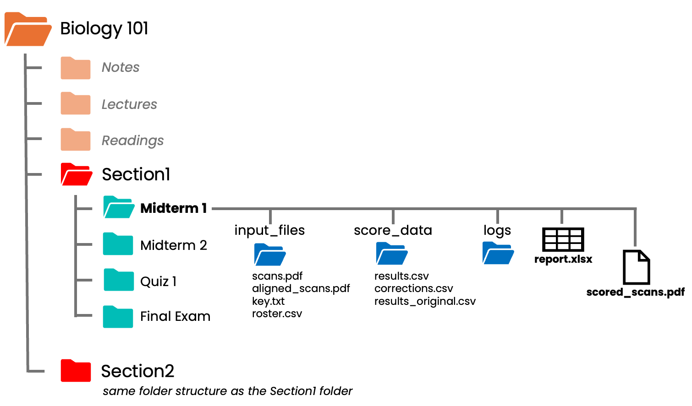
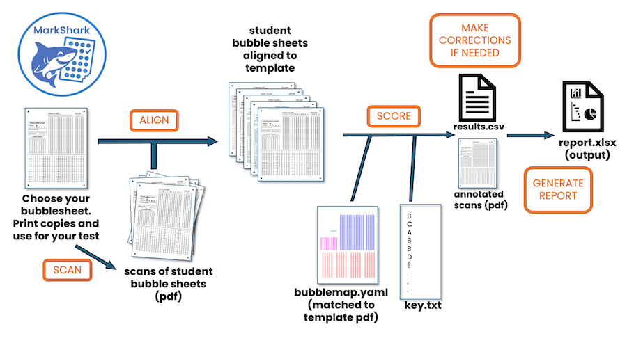

# Getting Started
**Note: if you're new to MarkShark we have a tutorial PDF and a practice dataset for you to download and experiment with on the welcome page.**
# Step 1 - Find a bubble sheet that meets your needs.
MarkShark comes with many different bubble sheets templates you can download, print, and use right away.  MarkShark bubble sheet templates comprise two files - a pdf and an associated text file (a **bubblemap**) that tells the software what each of the bubbles represents.
On the **Welcome page** you can click 'Browse Templates' and see the various bubble sheets that can be used right away with MarkShark.  In the **Template Manager** you can get a closer look at each of the templates, select some favorites, and archive the ones you don't want to use to get them out of the way.  Click on the 'Download PDF' button and you can print and use these bubble sheets right away!
***Can I continue to use a non MarkShark bubble sheet I've already been using?***  
*Uhhhh...yes and no.*  MarkShark can't decode a bubble sheet just by looking at it.  Every bubble sheet needs a corresponding **bubblemap** file that tells the software where the bubbles are on the page and what they represent.
It's not *that* hard to make a bubblemap for a pre-existing bubble sheet (its just a text file and we give you instructions) but it does take some effort up front.  Once you make a bubblemap for a particular bubble sheet you can reuse it forever.  You'll have to decide for yourself whether the up-front effort (an hour) to make an accurate bubblemap for your old bubblesheet is worth it.
# Step 2 - Set up your MarkShark folder(s) on your computer.
You should put a MarkShark folder inside the folder you might already use for your course files (for your lectures, syllabi, notes, etc.).  You don't have to name the folder MarkShark...you can call it 'tests' or 'test scores' or 'section 101 scores'.  Doesn't matter.  MarkShark will remember where it is.  You can have several MarkShark folders even within the same course folder (one for each section of a large class, for example).
For each new assessment (quiz, test, exam) MarkShark will create a new 'assessment' subfolder where it will automatically store the scans, keys, rosters, and output reports/scores associated with that particular assessment.
In the example below, the teacher of Biology 101 has put two MarkShark folders (red) inside their course's main folder, one for each of the sections they teach.  They did this because the two sections enroll different students and it was important to keep their marks separate (you could decide to merge course sections if you so choose).  Inside each of the MarkShark folders are folders for each of the tests held during the course.  Looking inside the midterm 1 folder you see the 'input_files' folder holds a pdf of the scans, the midterm 1 answer key, and the class roster.  The scored_scans.pdf and final report output are kept in the main assessment folder.  Other files MarkShark needs are kept in the logs and score_data folders.

# Step 3 - workflow after the test
So you're back in your office after the test. What's next?
1. **Scan** your student bubble sheets as a single PDF. [*See scanning tips below*](#scanning-tips).
2. **Open MarkShark** and go to the **Grader** page.
3. **Create a new assessment within your course's MarkShark folder**
4. **Upload your scans, answer key, and optionally a class roster.** [*See how to create your key and class roster*](key_formats.md)
5. Click **Align & Score** — MarkShark will align and score your sheets.
6. **Review & Correct** flagged items on the Review & Correct page.
7. If you make corrections, click **Apply Corrections & Re-annotate** to update the scored PDF and CSV.
8. **Generate a report** with statistics, item analysis, and per-student details.

## Scanning tips
The best way to avoid issues is to feed MarkShark good scans of your student bubblesheets.  With good scans you will encounter few, if any, issues.
- **Use a scanner with a document feeder.** Many multi-function laser printers and photocopiers can work to get you scans that are 
- **Scan using grayscale, at a resolution of 150 dpi.**  There's not much benefit having a resolution greater than 150 dots per inch and a 300 dpi image is 4x larger in terms of file size.  It's unlikely that your scans will perform significantly better with a higher resolution, but don't go much lower than 150 dpi either.
- **Do not use a phone camera.**  Photos taken with a phone warp the image unless you are looking straight down upon the scan and the paper is flat, not curled.  Lighting across the picture is often uneven and shadows from your arms or the camera can make certain areas of the scan much darker than others.  Any time you save using your phone will cost you later in troubleshooting how to de-warp the poor-quality scan.
- **Use white paper for your bubble sheets.** MarkShark must distinguish between gray pixels that are background vs. gray pixels that were caused by a pencil mark.  If your background paper is colored it will often appear as gray when converted to black and white.  You want to maximize the difference between the gray-level on the paper and the pencil marks written by the student.
## Your answer key 
[See more about ways to make your answer key here.](getting-started.md)
## Your class roster (optional)

---
# More about the MarkShark folders and files

### input_files/
Where your original uploads are stored: scanned PDFs, answer keys, and rosters. The aligned PDF (`aligned_scans.pdf`) is also saved here after alignment.
### score_data/
Where grading outputs live: the scored `results.csv`, scoring parameters (`results_params.json`), and any `corrections.csv` from the Review page. If you re-annotate, the original results are archived as `results_original.csv`.
### Top-level outputs
The `scored_scans.pdf` (annotated PDF with scores) and `exam_report.xlsx` are placed at the assessment root for easy access.
---
## An Overview of MarkShark Pages
### Welcome
XXX.
### Grader
The main grading page. Load scans, select a template, provide an answer key and optional roster, then click **Align & Score**. After scoring, switch to the **Generate Report** tab to create an Excel report.
### Review & Correct
View scored results in a spreadsheet alongside the annotated PDF. Click on a student row to see their scanned sheet. Double-click answer cells to correct misread answers or student IDs. Corrections are saved automatically.

When corrections are ready, click **Apply Corrections & Re-annotate** to re-run scoring with your corrections applied. This updates both the CSV scores and the annotated PDF — corrected answers are marked with teal diamonds and a "Corrections applied" stamp. Use **Clear Corrections** to start fresh if needed.
---
## Management
### Course Manager
Manage your courses and assessments. Browse course folders, view assessment contents, create new assessments, and open them directly in the Grader.
### Template Manager
Browse, preview, favourite, and reorder your installed bubble sheet templates. Each template includes a PDF master and a bubblemap YAML that defines bubble positions.
### LMS Integration
Import and export gradebook files for learning management systems (Canvas, Brightspace, etc.).
---
## Standalone Tools
### Align Only
Run the alignment step independently. Useful for troubleshooting alignment issues or preparing scans for external processing.
### Score Only
Run scoring on pre-aligned PDFs without re-running alignment. Useful for re-scoring with different thresholds.
### Report Only
Generate a report from existing results and corrections without re-running the full pipeline.
---
## Utilities
### Answer Key Utility
Create, import, edit, and export answer keys. Supports importing from text files, CSVs, and Excel spreadsheets. Build keys from scratch with per-question answer selection and multi-answer support.
### PDF Tools
Split, merge, and manipulate PDF files. Useful for preparing scans or combining output documents.
### Mock Data Utility
Generate synthetic student datasets for testing. Creates fake scans, answer keys, response CSVs, and rosters from any installed template. Useful for testing templates before real grading.
### Bubblemap Utility
Overlay the bubblemap grid onto a template PDF to visually verify that bubble positions are correctly defined. Supports multi-page templates and shows the output zone location.

---
## Getting Help
- **GitHub:** [github.com/navarrew/markshark](https://github.com/navarrew/markshark)
- **Issues:** Report bugs or request features on the GitHub Issues page.

[see Getting Started](getting_started.md)
[see Troubleshooting](scoring.md#troubleshooting)
[Answer Key Formats](key_formats.md)

- MarkShark works on both Mac and PC computers.
- MarkShark works for courses as small as 10 students to classes bigger than 1000!
- You can use a scanner you probably already own or have access to.
- You print your own bubble sheets, you don't have to order them.
- We provide many bubblesheet templates for you to choose from.
- *You can make your own custom bubble sheets using our companion platform* ***'Bubblefish'***
- Make a mistake with your answer key?  No problem!  You can rescore in seconds!
- A student fill in their ID incorrectly?  No problem!  You can fix it with a click!
- You scanned one page upside-down?  No problem!  Our PDF tools can fix it fast!
- You can easily copy student scores directly into the spreadsheet your course software uses. It's easy to integrate MarkShark with any LMS!
- MarkShark accepts a variety of answer key formats.
- MarkShark generates a report that is easy to read and understand.
- MarkShark's annotated student scan output makes it easy to see why a student got their score.