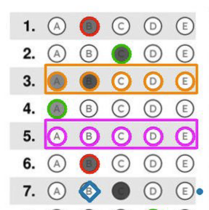

# Scoring
After alignment, MarkShark uses the bubblemap to locate the bubbles on the scanned bubble sheet.  The scoring algorithm measures how dark each bubble is and decides which ones the student filled in. MarkShark uses multiple techniques to handle variation in pencil darkness, paper quality, and scanning conditions.  Finally, MarkShark uses the answer key to calculate the score that the student receives and output the annotated scanned pdf for the teacher and student to see.
## Table of Contents
- [An overview of the scoring process](#an-overview-of-the-scoring-process)
- [Tips for successful scoring](#tips-for-successful-scoring)
- [Formatting your answer key](#formatting-your-answer-key)
- [Understanding the scored scan output](#understanding-the-scored-scan-pdf)
- [Reviewing results and making corrections](#reviewing-results-and-making-corrections)
- [Rescoring Mode](#rescoring-mode)
- [Troubleshooting](#troubleshooting)
- [Basic scoring and annotation parameters](#basic-scoring-and-annotation-parameters)
- [Advanced scoring parameters](#advanced-scoring-parameters)
---
# An overview of the scoring process
1. **Render** each aligned page as a black and white image at the configured DPI.
2. **Extract** the pixel region for each bubble using the bubblemap grid coordinates.
3. **Calculate a 'fill score'** for each bubble as a percentage of pixels in the bubble that exceed a certain darkness threshold.
4. **Decide** which bubbles are "filled" using thresholds and calibration.
5. **Compare** to the answer key and compute scores.
6. **Flag** any rows with ambiguous results (blanks, multi-fills).
7. **Output** a marked-up pdf and a results.csv spreadsheet for review and report generation.
# Tips for Successful Scoring
- **Use a flatbed scanner and not a phone** — Images taken by phone have variable lighting and make alignments much harder.
- **Scan grayscale at 150 dpi or greater** - color is not necessary for MarkShark, it just converts the image to black-gray-white (grayscale) for scoring anyway.
- **If possible use scan settings where the background paper is shown as white, not gray**
- **Scan at consistent settings** — Use the same scanner settings for all sheets in a batch.
- **Start with defaults** — The default thresholds work well for most scan qualities. Only adjust if you see systematic issues.
# Scoring Outputs
After you do a scoring run, MarkShark will output new files into your assessment directory.  In the assessment directory a new pdf will appear called **'scored_scans.pdf'**.  Inside the **score_data** folder you will find a new file named **results.csv**.

*MarkShark produces a marked-up pdf of your scanned bubblesheets **(scored_scans.pdf)** where each correct answer is circled in green, each incorrect answer is circled in red, where empty rows are flagged by a pink box, and multi-filled rows are flagged with an orange box.*
# Formatting your answer key
MarkShark handles a lot of different answer key formats and even has a utility page to help you construct a key from scratch.  We also provide sample keys that you can download and change to put in your own answers on the for download on the welcome page.  For more about the answer key, check out the description on the 'Getting Started' help page or get more depth about alternative key formats (including multiple answers, A or B answers, etc) on the 'Reference' help page.
# Understanding the scored scan PDF
The scored_scans.pdf allows you to review each student's bubblesheet to check for any inconsistencies and identify any problems with the scoring process.  
- **Blue text above each bubble shows its adjusted %fill score.** *(the percentage of pixels within the bubble called 'filled' after background levels of gray were subtracted)*
- **Correct answers are circled in green.** *(if a key has been provided)*
- **Incorrect answers are circled in red.** *(if a key has been provided)*
- **Rows that were not filled in are boxed in purple.**
- **Rows that incorrectly have more than one bubble filled in are boxed in orange.**
The image below is a zoomed in look at questions marked in a sample bubblesheet.  In each row you can see that the unfilled bubbles have adjusted fill scores close to zero while the filled bubbles have adjusted fill scores close to 100.

*If your scanned bubblesheets are getting scores where the filled and unfilled bubbles are getting fill scores too close to one another - see what parameters can be adjusted in the trobleshooting section below.*
# Reviewing results and making corrections
xxx

## Flag Types
XXX
MarkShark flags rows that need human review:
| Flag | Meaning |
|------|---------|
| **Blank** | No bubble met the fill threshold for this question |
| **Multi** | Two or more bubbles appear filled (ambiguous) |
| **Absent** | Student ID found in roster but no scanned sheet detected |
| **Low confidence** | Fill scores are close to the threshold |
Flagged rows appear highlighted on the Review & Correct page, where you can manually correct them.

# Rescoring Mode
If you realize you have a mistake on your key or roster, or uploaded the wrong key or roster, you can easily rescore the scans without having to go through the process of scan alignment.

---
## Results CSV Columns
The `results.csv` file in `score_data/` contains one row per student:
| Column | Description |
|--------|-------------|
| Page | Page number in the annotated PDF |
| Version | Detected test version (A, B, C, etc.) |
| LastName | Student's last name (from bubbled name or roster) |
| FirstName | Student's first name |
| StudentID | Student ID (from bubbled ID field) |
| Correct | Number of correct answers |
| Incorrect | Number of incorrect answers |
| Blank | Number of blank (unanswered) questions |
| Multi | Number of multi-fill (ambiguous) questions |
| Flagged | "Y" if the student has any flags, otherwise blank |
| FlagDetails | Pipe-separated flag codes (e.g. Q5:blank\|Q10:multi\|ID:orphan) |
| Q1, Q2, ... | Student's detected answer for each question |

---
# Troubleshooting
MarkShark tries to determine whether a pixel is 'filled' (by a pencil) or is simply gray due to background noise.  It sets a darkness threshold, beyond which a pixel is called filled and below which (lighter gray than the threshold) the pixel is determined to be background.  Markshark will adjust the gray threshold for each scan in an attempt to maximize the contrast difference between filled bubbles and unfilled bubbles.  If the original scans have poor contrast, uneven lighting, or the student has written lightly in the bubbles, the differences in darkness make it difficult for the software to distinguish between genuinely filled bubbles and the background.
# Basic Scoring and Annotation Parameters
The parameters below can be adjusted in the Grader panel.
- **Min % Fill (Default: 45)**  The minimum fill score for a bubble to count as filled. A bubble with a fill score below this threshold is considered empty.
- **Fixed Threshold (Default: 180)**  A global binarisation threshold for gray pixel values (0-255). Used as a baseline for determining mark darkness.
  - **Higher** = requires darker marks (may miss light pencil marks)
  - **Lower** = accepts lighter marks (may pick up stray marks or printing)
- **Annotate All Bubbles (Default: on)**  Draw circles on every bubble in the scored PDF, not just the filled ones. Makes it easy to visually verify alignment and see what the scorer detected.
- **Show % Fill Labels (Default: on)**  Overlay the percentage fill score as text at each bubble position. Useful for diagnosing threshold issues.
---
# Advanced Scoring Parameters
- **Auto-Calibrate Threshold (Default: on).**  Automatically tunes the fill threshold for each page. This handles variation between pages caused by different pencil types, scan darkness, or paper quality.
- **Verbose Threshold Diagnostics (Default: on).**  Prints per-page threshold calibration details to the log. Useful for debugging threshold issues.
- **Calibrate Background (Default: on).**  Subtracts per-column background darkness to remove bias from printed letters (A, B, C, D, E) inside or near bubbles. Without this, columns with darker printed letters may produce higher fill scores.
- **Background Percentile (Default: 10.0).**  The percentile used for background calculation. The 10th percentile is robust to noise — it represents the "normal" unfilled darkness for each column.
- **Adaptive Rescoring (Default: on).**  When a row initially comes back as "blank" (no bubble meets the threshold), adaptive rescoring tries progressively lower thresholds to find a valid answer. This rescues light pencil marks that the normal threshold misses.
- **Adaptive Max Adjustment (Default: 40).**  Maximum threshold reduction to try during adaptive rescoring, in steps of 10. For example, if set to 40, the engine tries thresholds lowered by 10, 20, 30, and 40.
- **Adaptive Min Above Floor (Default: 30).**  During adaptive rescoring, the winning bubble must be this many points above the lowest bubble in the row. This prevents accepting noise as an answer.
