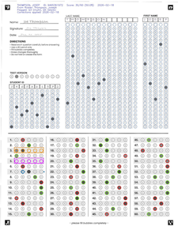
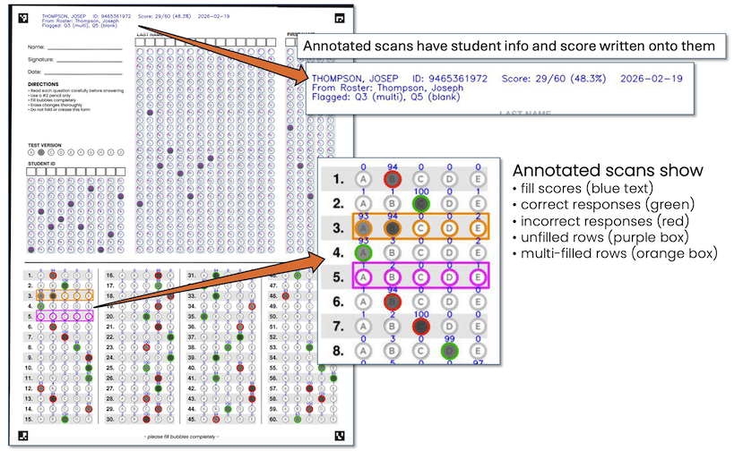

# Scoring

After alignment, MarkShark uses the bubblemap to locate every bubble on the scanned sheet. The scoring algorithm measures how dark each bubble is and decides which ones the student filled in. MarkShark uses multiple techniques to handle variation in pencil darkness, paper quality, and scanning conditions. Finally, it compares the detected answers to your answer key to calculate scores, and produces a marked-up PDF so you and your students can see exactly what was read.

## Table of Contents
- [An Overview of the Scoring Process](#an-overview-of-the-scoring-process)
- [Tips for Successful Scoring](#tips-for-successful-scoring)
- [Formatting Your Answer Key](#formatting-your-answer-key)
- [Scoring Outputs](#scoring-outputs)
- [Understanding the Scored Scan PDF](#understanding-the-scored-scan-pdf)
- [After Scoring: Review and Report](#after-scoring-review-and-report)
- [Rescoring Mode](#rescoring-mode)
- [Results CSV Columns](#results-csv-columns)
- [Troubleshooting](#troubleshooting)
- [Basic Scoring and Annotation Parameters](#basic-scoring-and-annotation-parameters)
- [Advanced Scoring Parameters](#advanced-scoring-parameters)

---

## An Overview of the Scoring Process

1. **Render** each aligned page as a grayscale image at the configured DPI.
2. **Extract** the pixel region for each bubble using the bubblemap grid coordinates.
3. **Calculate a "fill score"** for each bubble — the percentage of pixels in the bubble that exceed a darkness threshold.
4. **Decide** which bubbles are "filled" using thresholds and calibration.
5. **Compare** to the answer key and compute scores.
6. **Flag** any rows with ambiguous results (blanks, multi-fills).
7. **Output** a marked-up PDF and a results CSV spreadsheet for review and report generation.

---

## Tips for Successful Scoring

- **Use a flatbed scanner, not a phone** — phone images have variable lighting and perspective distortion that make alignment much harder.
- **Scan in grayscale at 150 DPI or higher** — colour is not needed. MarkShark converts everything to grayscale for scoring anyway.
- **If possible, use scanner settings where the paper background appears white, not gray** — this improves contrast between filled and unfilled bubbles.
- **Scan at consistent settings** — use the same scanner settings for all sheets in a batch.
- **Start with defaults** — the default thresholds work well for most scan qualities. Only adjust if you see systematic issues.

---

## Formatting Your Answer Key

MarkShark works with many different answer key formats and has a built-in [Answer Key Utility](utilities.md#the-answer-key-utility) to help you create one from scratch. You can also download a sample key from the Welcome page, replace the answers with your own, and save. For the full details on key formats — including multi-version keys, partial credit, and advanced scoring operators — see [Answer Keys and Rosters](key_formats.md).

---

## Scoring Outputs

After a scoring run, MarkShark creates two new files in your assessment directory:

- **scored_scans.pdf** — a marked-up copy of your scanned bubble sheets, saved in the assessment's root folder.
- **results.csv** — a spreadsheet with one row per student, saved inside the **score_data** folder.

*MarkShark produces a marked-up PDF **(scored_scans.pdf)** where correct answers are circled in green, incorrect answers are circled in red, blank rows are boxed in purple, and multi-filled rows are boxed in orange.*

---

## Understanding the Scored Scan PDF

The scored_scans.pdf lets you review each student's bubble sheet to check for inconsistencies and identify any problems with the scoring process.

- **Blue text above each bubble shows its adjusted % fill score** — the percentage of filled pixels after background subtraction.
- **Correct answers are circled in green** (when a key has been provided).
- **Incorrect answers are circled in red** (when a key has been provided).
- **Blank rows** — rows where no bubble met the fill threshold — **are boxed in purple.**
- **Multi-fill rows** — rows where two or more bubbles appear filled — **are boxed in orange.**

The image below is a zoomed-in look at questions on a scored sheet. In each row you can see that unfilled bubbles have adjusted fill scores close to zero while filled bubbles have scores close to 100.

*If your scored sheets show fill scores where filled and unfilled bubbles are too close together, see the [Troubleshooting](#troubleshooting) and [Advanced Scoring Parameters](#advanced-scoring-parameters) sections below.*

---

## After Scoring: Review and Report

After scoring, you should review the results before generating your final report. Students sometimes mis-fill their names, forget to bubble their student ID, skip a row, or erase a bubble poorly enough that the scanner picks it up as a mark. MarkShark flags these cases so you can catch them.

Head to the **[Review & Correct](corrections.md)** page to inspect flagged items, correct individual student issues, and finalize your results. Once you're satisfied, you can generate your report from the Report page.

---

## Rescoring Mode

If you discover a mistake in your answer key or roster — or uploaded the wrong file — you don't need to re-align your scans. On the Grader page, check the **Rescore** option to skip alignment and re-score using the aligned scans from your previous run. Just update your key or roster, tick the Rescore checkbox, and run again. This is much faster than starting from scratch and ensures every student is re-graded against the corrected key.

---

## Results CSV Columns

The `results.csv` file in `score_data/` contains one row per student:

| Column | Description |
|--------|-------------|
| Page | Page number in the annotated PDF |
| Version | Detected test version (A, B, C, etc.) |
| LastName | Student's last name (from bubbled name or roster) |
| FirstName | Student's first name |
| StudentID | Student ID (from bubbled ID field) |
| Correct | Number of correct answers |
| Incorrect | Number of incorrect answers |
| Blank | Number of blank (unanswered) questions |
| Multi | Number of multi-fill (ambiguous) questions |
| Flagged | "Y" if the student has any flags, otherwise blank |
| FlagDetails | Pipe-separated flag codes (e.g. Q5:blank\|Q10:multi\|ID:orphan) |
| Q1, Q2, ... | Student's detected answer for each question |

---

## Troubleshooting

MarkShark needs to determine whether a pixel is "filled" by a pencil or is simply gray due to background noise. It sets a darkness threshold — pixels darker than the threshold are called filled, and lighter pixels are treated as background. MarkShark adjusts this threshold for each scan to maximize the contrast between filled and unfilled bubbles.

If the original scans have poor contrast, uneven lighting, or a student has written very lightly, the difference in darkness between filled and unfilled bubbles may be too small for the software to reliably distinguish them. In these cases, you may need to adjust the scoring parameters described below.

---

## Basic Scoring and Annotation Parameters

These parameters are available on the Grader page under the settings tab.

- **Min % Fill (Default: 45)** — the minimum fill score for a bubble to count as filled. A bubble with a fill score below this threshold is considered empty.
- **Fixed Threshold (Default: 180)** — a global binarisation threshold for gray pixel values (0–255). Used as a baseline for determining mark darkness.
  - **Higher** = requires darker marks (may miss light pencil marks)
  - **Lower** = accepts lighter marks (may pick up stray marks or printing)
- **Annotate All Bubbles (Default: on)** — draw circles on every bubble in the scored PDF, not just the filled ones. Makes it easy to visually verify alignment and see what the scorer detected.
- **Show % Fill Labels (Default: on)** — overlay the percentage fill score as text at each bubble position. Useful for diagnosing threshold issues.
- **Auto-Calibrate Threshold (Default: on)** — automatically tunes the fill threshold for each page. This handles variation between pages caused by different pencil types, scan darkness, or paper quality.
- **Verbose Threshold (Default: on)** — prints per-page threshold calibration details to the log. Useful for debugging threshold issues.

---

## Advanced Scoring Parameters

The parameters below are available on the **Score Only** page, which gives you fine-grained control over scoring beyond what the Grader exposes.

- **Calibrate Background (Default: on)** — subtracts per-column background darkness to remove bias from printed letters (A, B, C, D, E) inside or near bubbles. Without this, columns with darker printed letters may produce higher fill scores.
- **Background Percentile (Default: 10.0)** — the percentile used for background calculation. The 10th percentile is robust to noise — it represents the "normal" unfilled darkness for each column.
- **Adaptive Rescoring (Default: on)** — when a row initially comes back as "blank" (no bubble meets the threshold), adaptive rescoring tries progressively lower thresholds to find a valid answer. This rescues light pencil marks that the normal threshold misses.
- **Adaptive Max Adjustment (Default: 40)** — maximum threshold reduction to try during adaptive rescoring, in steps of 10. For example, if set to 40, the engine tries thresholds lowered by 10, 20, 30, and 40.
- **Adaptive Min Above Floor (Default: 30)** — during adaptive rescoring, the winning bubble must be this many points above the lowest bubble in the row. This prevents accepting noise as an answer.
